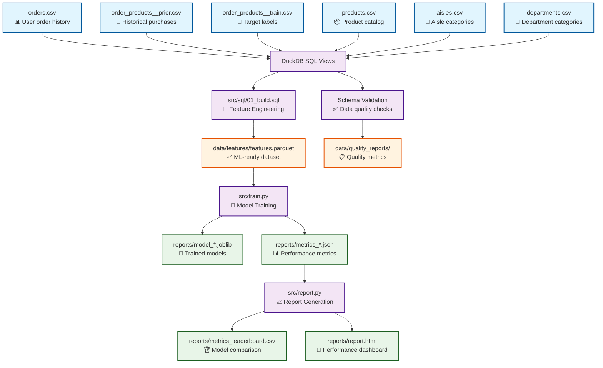

# Instacart Reorder Prediction Pipeline

## Key Results & Performance

**Best Model Performance:** XGBoost achieved **ROC-AUC 0.8289**, demonstrating strong predictive capability for customer reorder behavior.

| Rank | Model | ROC-AUC | PR-AUC | F1@0.5 | Order-F1@top-10 | Training Time |
|------|-------|---------|--------|--------|------------------|---------------|
| 1 | **XGBoost** | **0.8289** | 0.402 | 0.249 | 0.341 | 663.4s |
| 2 | **LightGBM** | **0.8282** | 0.401 | 0.373 | 0.341 | 398.2s |
| 3 | **LogisticRegression** | **0.816** | 0.356 | 0.347 | 0.331 | 127.1s |

**Key Technical Achievements:**
- **End-to-End ML Pipeline**: Complete workflow from raw CSV data to production-ready models
- **Rigorous Data Leakage Prevention**: Strict temporal separation between feature engineering and labels
- **Business-Relevant Metrics**: Custom Order-F1 metric measuring set-based prediction accuracy per user
- **Scalable Architecture**: SQL-based feature engineering processing 6.7M+ training samples
- **Reproducible Results**: Three-command pipeline with deterministic outputs
- **Data Quality Assurance**: Schema validation and automated quality checks
- **Structured Logging**: Complete observability and debugging capabilities

**Dataset Scale:** 6.7M+ training samples, 12 ML features (from 15 engineered columns), 1.7M validation samples

### Interactive Performance Dashboard

The complete performance analysis is available in the generated HTML report at `reports/report.html`. Key highlights from the latest run:

**Model Comparison Summary:**
- **Best ROC-AUC**: 0.8289 (XGBoost) 
- **Training Efficiency**: LightGBM offers best speed/performance trade-off (398.2s)
- **Feature Engineering**: 12 ML features from 15 engineered columns (6 raw data sources)
- **Evaluation Rigor**: Set-based Order-F1 metric reflects real business value

**Business Impact Metrics:**
- **Order-F1@top-10**: 0.341 - accurately predicts ~34% of user's actual reorder set
- **Precision-Recall AUC**: 0.402 - strong performance on imbalanced dataset
- **Scalability**: Processes 6.7M+ samples with sub-700s training time

## Project Overview

This project implements a complete machine learning pipeline to predict which products a customer will reorder in their next shopping basket on Instacart. The system follows a structured approach: SQL-based feature engineering using DuckDB, training multiple classification models (LogisticRegression, XGBoost, LightGBM), and generating an HTML performance report.

**Business Objective:** Predict the probability that a user will reorder each product they have previously purchased, enabling personalized product recommendations and inventory optimization.

**Target Performance:** ROC-AUC ≥ 0.83 with Order-F1 improvement over baseline approaches.


## Three-Command Reproduction Workflow

The entire pipeline can be reproduced with exactly three commands:

```bash
# 1. Build feature dataset from CSV files using SQL
python src/build_dataset.py

# 2. Train a model (choose: logreg, xgb, or lgbm)
python src/train.py --model logreg
python src/train.py --model xgb  
python src/train.py --model lgbm

# 3. Generate performance report and leaderboard
python src/report.py
```

### Alternative: Makefile Orchestration

For production-ready orchestration, use the Makefile commands:

```bash
# Build features with data validation
make build

# Train specific model with configuration
make train MODEL=xgb

# Generate comprehensive reports
make report

# Run end-to-end validation
make validate

# Clean intermediate files
make clean
```

### Configuration Management

The pipeline uses centralized configuration via `config.yaml`:

```yaml
data:
  raw_path: "data/raw"
  features_path: "data/features"
  
sampling:
  max_users: null  # null = no sampling
  random_seed: 42
  
models:
  default_topk: 10
  xgboost:
    n_estimators: 2000
    learning_rate: 0.05
    
logging:
  level: "INFO"
```

**Configuration Override Examples:**
```bash
# Override config values via command line
python src/train.py --model xgb --override models.xgboost.n_estimators=1000

# Use custom config file
python src/report.py --config custom_config.yaml
```

### Setup Instructions

1. **Create and activate virtual environment:**
```bash
# Windows
python -m venv venv
venv\Scripts\activate

# Unix/macOS
python3 -m venv venv
source venv/bin/activate
```

2. **Install dependencies:**
```bash
pip install -r requirements.txt
```

3. **Ensure data files are in place:**
```
data/
├── orders.csv
├── order_products__prior.csv
├── order_products__train.csv
├── products.csv
├── aisles.csv
└── departments.csv
```

## Data Schema and Features

### Input Data Schema
- **orders.csv:** User order history with timing information
- **order_products__prior.csv:** Products in historical orders (for feature engineering)
- **order_products__train.csv:** Products in final orders (for labels only)
- **products.csv:** Product catalog with aisle/department mappings
- **aisles.csv:** Product aisle categories
- **departments.csv:** Product department categories

### Engineered Features
The SQL-based feature engineering creates 15 columns, of which 12 are used as ML features (excluding user_id, product_id, y):

**User-Product Interaction Features:**
- `times_bought`: Total number of times user purchased this product
- `times_reordered`: Number of times user reordered this product (excludes first purchase)
- `user_prod_reorder_rate`: Reorder rate for this specific user-product combination
- `last_prior_ordnum`: Order number of last purchase (recency indicator)
- `orders_since_last`: Number of orders since last purchase of this product
- `avg_add_to_cart_pos`: Average position in cart when user adds this product
- `avg_days_since_prior`: Average days between user's orders

**Product Popularity Features:**
- `prod_cnt`: Global popularity (total times product was purchased)
- `prod_users`: Number of unique users who purchased this product

**Categorical Features:**
- `aisle_id`: Product aisle category
- `department_id`: Product department category

**Target Variable:**
- `y`: Binary label (1 if product was reordered in train set, 0 otherwise)

**Note:** `user_id` and `product_id` are excluded from ML training to prevent overfitting. Product information is captured through aggregated features (`prod_cnt`, `prod_users`, `prod_avg_reorder_rate`) and categorical features (`aisle_id`, `department_id`).

## Methodology

### Data Leakage Prevention
**Critical Design Decision:** Strict separation between feature engineering and label generation:
- **Features:** Built exclusively from 'prior' orders (historical data)
- **Labels:** Generated only from 'train' orders (target outcomes)
- **Validation:** GroupShuffleSplit on user_id prevents user leakage between train/validation sets

This ensures the model cannot "cheat" by seeing future information during training.

### Evaluation Approach
The pipeline uses multiple complementary metrics:

1. **ROC-AUC:** Standard binary classification metric
2. **PR-AUC:** Precision-Recall AUC, better for imbalanced datasets
3. **F1@0.5:** F1 score at 0.5 probability threshold
4. **Order-F1@top-k:** Custom set-based metric that measures how well we predict the actual set of reordered products per user

**Order-F1 Calculation:**
```python
# For each user:
true_set = {products actually reordered}
pred_set = {top-k predicted products}
f1_user = 2 * |intersection| / (|true_set| + |pred_set|)

# Final metric:
order_f1 = mean(f1_user across all users)
```

This metric captures the business objective: predicting the right set of products per user, not just individual product probabilities.

### Model Selection
Three complementary approaches:
- **LogisticRegression:** Fast baseline with interpretable coefficients
- **XGBoost:** Gradient boosting with excellent tabular performance  
- **LightGBM:** Memory-efficient alternative to XGBoost

All models use the same preprocessing pipeline:
- **StandardScaler:** Normalize numeric features
- **OneHotEncoder:** Handle categorical features (aisle_id, department_id)

## Data Flow and Lineage

### Pipeline Architecture Overview
```
Raw Data → Feature Engineering → Model Training → Performance Reports
```

### Detailed Data Lineage




## Project Structure

```
instacart-reorder-prediction/
├── venv/                         # Python virtual environment (excluded from git)
├── data/                         # Layered data organization
│   ├── raw/                      # Original CSV files
│   │   ├── orders.csv
│   │   ├── order_products__prior.csv
│   │   ├── order_products__train.csv
│   │   ├── products.csv
│   │   ├── aisles.csv
│   │   └── departments.csv
│   ├── intermediate/             # Temporary processing results
│   ├── features/                 # ML-ready datasets
│   │   └── features.parquet
│   └── quality_reports/          # Data validation outputs
├── src/
│   ├── sql/01_build.sql          # Feature engineering SQL with educational comments
│   ├── schemas/                  # Data validation schemas
│   │   └── input_schemas.py      # Pandera schema definitions
│   ├── build_dataset.py          # SQL executor → parquet converter
│   ├── train.py                  # ML pipeline & training with extensive documentation
│   ├── report.py                 # HTML report generator
│   ├── data_quality.py           # Data validation and quality checks
│   ├── config_utils.py           # Configuration management
│   └── logging_utils.py          # Structured logging utilities
├── reports/                      # Output artifacts
│   ├── metrics_*.json            # Model performance metrics
│   ├── model_*.joblib            # Trained model pipelines
│   ├── metrics_leaderboard.csv   # Model comparison table
│   └── report.html               # Formatted performance report
├── docs/                         # Documentation
│   └── data_lineage.md           # Detailed data flow and transformation docs
├── config.yaml                   # Central configuration
├── Makefile                      # Orchestration commands
├── requirements.txt              # Python dependencies
├── .gitignore                    # Exclude venv/ and artifacts
└── README.md                     # This documentation
```


*This project demonstrates a complete, production-ready ML pipeline implementation with emphasis on educational clarity, reproducible results, proper evaluation methodology, and enterprise-grade infrastructure.*


